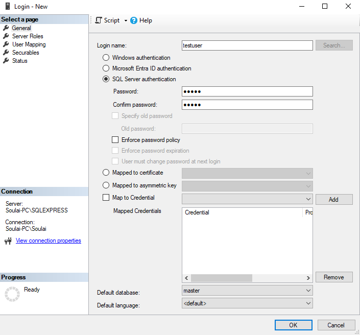
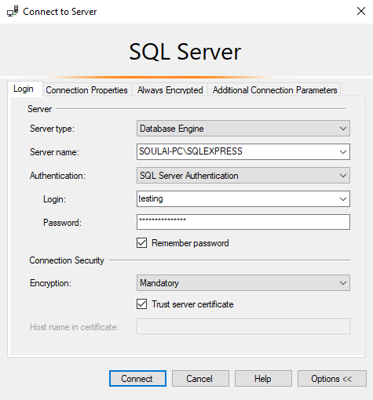
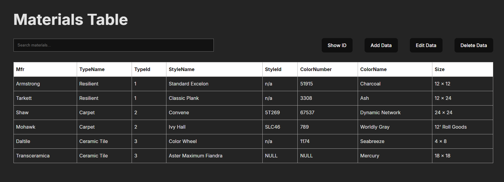

# Brief Overview
A simple full-stack application with CRUD functionalities. This project utilizes backend functionalities to connect to a database, and then the frontend offers a simple layout of data table where users are able to manipulate by creating, editing, deleting, and searching existing data entries.

# Installation Instructions

## Database Setup
Please ensure that you have [Microsoft SQL](https://www.microsoft.com/en-us/sql-server/sql-server-downloads) downloaded along with [SQL Server Management Studio (SSMS)](https://learn.microsoft.com/en-us/sql/ssms/download-sql-server-management-studio-ssms?view=sql-server-ver16). It should offer to download SSMS when you also install MS SQL as well. For this project, I utilized **Microsoft SQL Express**, which `server.js` is specifically configured to. Once downloaded, open up SSMS, connect, and create a new database name.

In SSMS, in order to connect to our backend in the future, right click the `Security` folder and create a new login. Choose a login name, and select `SQL Server authentication`. De-select `Enforce password policy` and choose a password. Once finished, go to `User Mapping` before finish creating the new login, select your database, and make sure that you check `db_owner` and then hit **OK.**

In the `SQL Scripts` folder, you will find two scripts. One is to create the table of materials, and the other is to populate it with initial data. Run `CreateTable.sql` in your chosen database. **Please note that the CreateTable.sql file already contains a default database name called CodeChallengeData. If you choose a different database name, ensure that you change the database name so it can run correctly in the file.** After creating the table, then run `PopulateTable.sql` to populate it with the initial data.

## Backend Setup
Ensure that you have [Node.js](https://nodejs.org/en/download) installed. In order to start up the backend, create your own `.env` file in the root of the `\backend` directory, along with credentials containing your `DB_USER`, `DB_PASSWORD`, `DB_SERVER`, `DB_NAME`, and `DB_PORT`. The user, password, server and name are all unique to your local machine with how you connected to your server in SSMS. Set the user and password to the login that you created previously, and the name as your database name that you have chosen. `DB_SERVER` can be found when you first connect to SSMS.

In this example, my `DB_SERVER` would be `SOULAI-PC`. You only need the name before the `\` for the server name. The database port is usually defaulted to `1433`, but to double-check, you can open up **SQL Server Configuration Manager**. Ensure that **TCP/ICP** is enabled, then right-click `Properties` and go over to the `IP Addresses` tab. Scroll all the way down to **IPAII**, and there you should see the port number as to which you should set up in your `.env` file. 

**Please note that in `server.js`, the default `instancename` is SQLEXPRESS. If you did not install MS SQL Express, you may need to change this to the correct instancename of your SQL version. This can be found after your DB_SERVER after the `\`**

Once you have all of your credentials made in your `.env` file, make sure that you are currently in the `\backend` directory and run `npm install`. This will install all necessary packages. Once everything is done installing, then run the command `npm start` to start up the backend server.

## Frontend Setup
Open up a second terminal and change your directory the `\frontend` directory. Run `npm install` once more to install all frontend packages and dependencies. Once everything is installed, and your backend is also running, then type `npm run dev`. This should open up the frontend, and if your backend is connected successfully, you should see a table displaying the initial data that you created in SSMS. Enjoy experiencing simple CRUD functionalities!

# Overview of Design Decisions & Tech Stack
For this project, the main framework that I utilized was React along with TypeScript for my frontend, while utilizing plain JavaScript and MS SQL for my backend. I chose these languages because they were the most familiar to me, along with enjoying React for making code more organized through its component-based framework logic and powerful use of states, as seen in `App.jsx`, where multiple states are maintained and kept track of to multiple different web components.

A few design choices stem from testing the application throughout its process, along with overall user experience. One example of this would be having a debouncing feature when searching and filtering results. This was a result of, when testing and filtering data, the table would update instantly, even when a user was still in the middle of typing. Because of this, it would become disorientating when typing to find a specific data point, so I researched and looked into debouncing to make this small feature. Along with this, I also implemented a highlighting feature for ease of use when deleting and editing a row of data, since this logic would carry over to both editing and deleting data. A lot of the work I did also stemmed from trying to make the code as dynamic as possible, such as the table and forms being made dynamically by looking at the data response. This is so if any changes were made to the backend (e.g. adding a new column to the table), then no changes would need to be made for the frontend and everything would still work.

My process of debugging included a lot of try and catch clauses, as seen throughout the code, especially when pertaining to fetching data, deleting, editing, or creating new data. These errors helped me narrow down any potential bugs throughout the process of creating this project, along with using built-in tools such as IDE debugging tools and inspecting the web page while printing things to the console.

If I had more time, some features that I would like to implement in the future would be to allow for multiple 'pages' of table data to be displayed, since if this would be connected to a larger dataset, then the table would span the entire page. So limiting data entries to say, ten per page would make things more visually less crowded. Along with this, when entries are deleted and new ones are created, the internal ID does not reset to any unused IDs. This would be a feature that I would also like to work on in the future if I were to continue this project. There are only two small bugs that I am aware of that I did not get to fixing if I had more time. If you search for an entry that does not exist, the existing components on the page will 'shrink' since the table does not exist, as it depends on the table to be displayed correctly. The other bug is if you edit a non-required field and clear it, it will display an empty data cell until refresh, which it will still be empty if the input type is text, or it will display a zero if the input type is an integer. Overall, I had an enjoyable time working on this project, as I had never really worked with the backend side of projects until this small project.